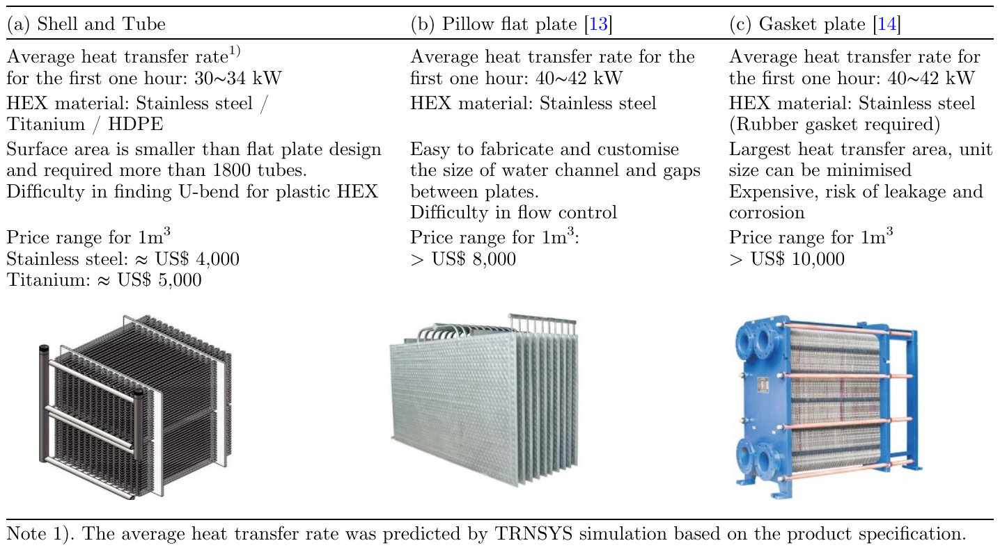
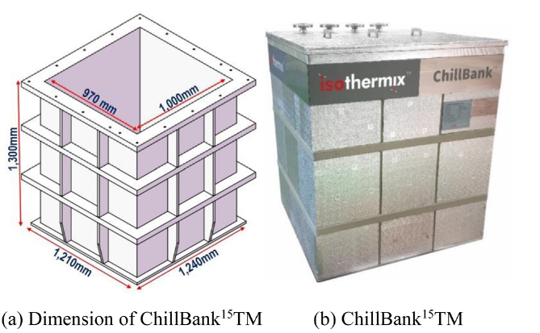
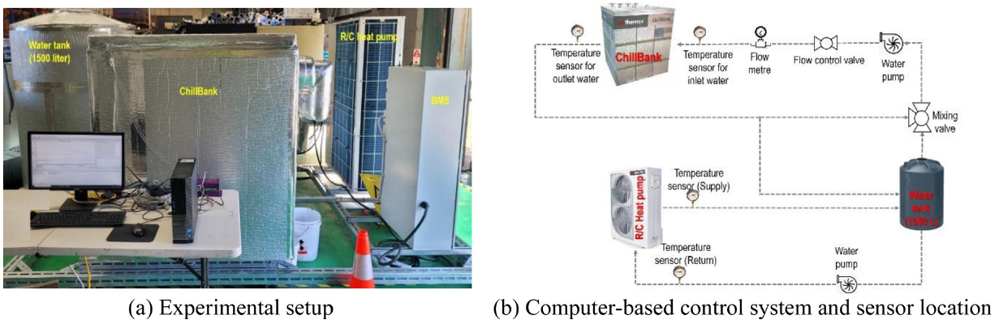
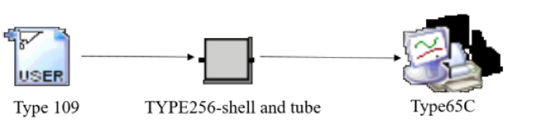
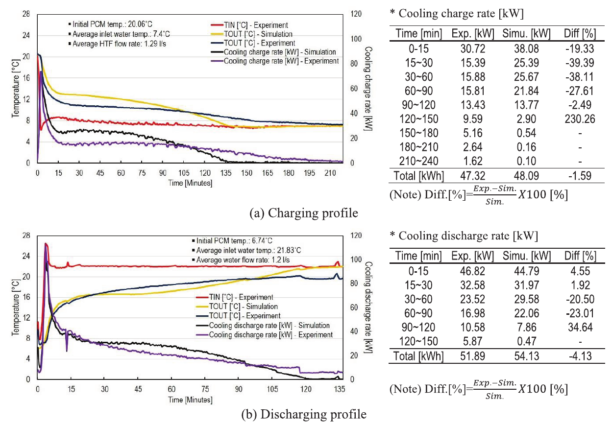
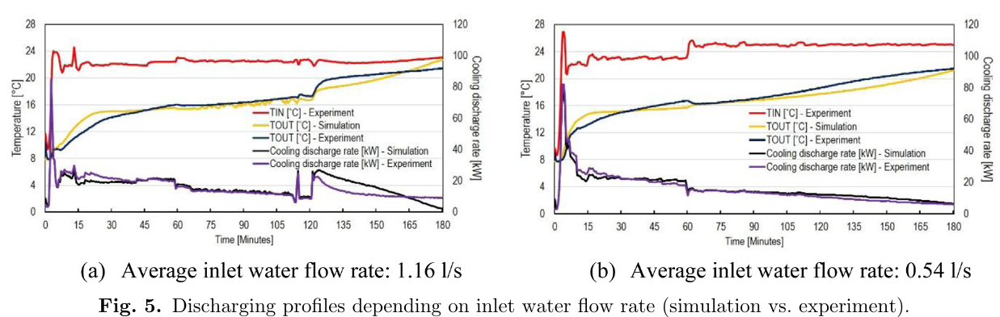
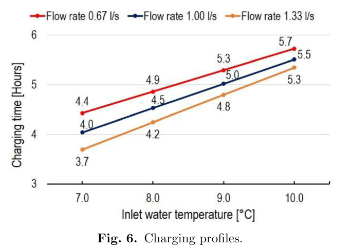
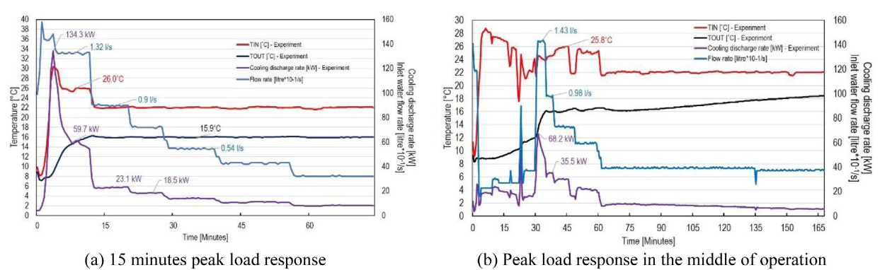
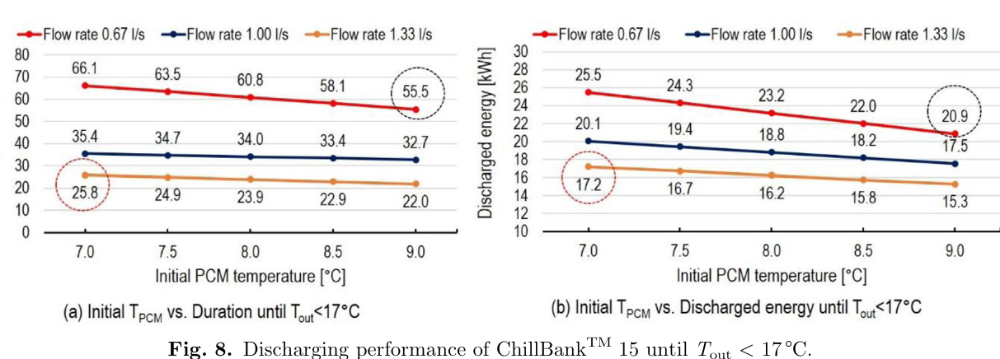
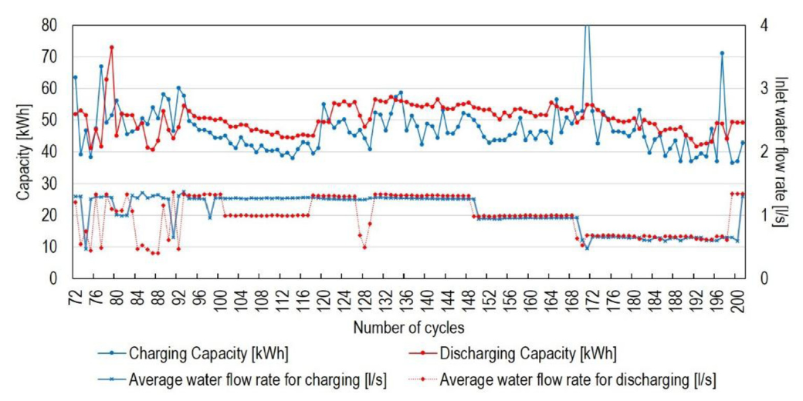

# Study Notes: "Smoothing cooling demand of buildings with PCM thermal batteries"

> **Paper:** Seung Ho Lee, Ming Liu, Wasim Saman, Michel Bostrom (2024).
> *Smoothing cooling demand of buildings with PCM thermal batteries.*
> Renewable Energy and Environmental Sustainability (REES) **9**, 6.
> DOI: [10.1051/rees/2024005](https://doi.org/10.1051/rees/2024005). Open access (CC‑BY 4.0), so the figures shown here are reproduced from the paper with attribution.

These notes go from the basic ideas to the details. If you have little time, read **Part 0** (the whole paper on one page) and **Part 14** (the paper as a short story). For exam or thesis work, read everything.

---

## Table of Contents

0. [The Whole Paper on One Page](#part-0--the-whole-paper-on-one-page)
1. [Basic Concepts You Need First](#part-1--basic-concepts-you-need-first)
2. [The Problem: Why This Research Exists](#part-2--the-problem-why-this-research-exists)
3. [Literature Review: What Was Already Known](#part-3--literature-review-what-was-already-known)
4. [Aim and Research Questions](#part-4--aim-and-research-questions)
5. [Methodology: How They Did It](#part-5--methodology-how-they-did-it)
6. [The Simulation Model: Input → Model → Output](#part-6--the-simulation-model-input--model--output)
7. [Results, Figure by Figure](#part-7--results-figure-by-figure)
8. [Key Numbers Cheat Sheet](#part-8--key-numbers-cheat-sheet)
9. [Authors' Conclusions](#part-9--authors-conclusions)
10. [Critical Evaluation: How Valid Is It?](#part-10--critical-evaluation-how-valid-is-it)
11. [Research Gaps](#part-11--research-gaps)
12. [Novelty and Contributions](#part-12--novelty-and-contributions)
13. [Future Research Directions](#part-13--future-research-directions)
14. [The Paper as a Short Story](#part-14--the-paper-as-a-short-story)
15. [Self-Test Questions (with Answers)](#part-15--self-test-questions-with-answers)
16. [References](#part-16--references)

---

## Part 0 — The Whole Paper on One Page

| Question | Answer in simple words |
|---|---|
| **What is it about?** | A big "cold battery" for office and commercial buildings. It stores cooling at night and releases it during the day, when air-conditioning demand and electricity prices are highest. |
| **What is inside the battery?** | 1.2 m³ of a special **salt + water mixture (salt-hydrate PCM)** that freezes and melts at **about 15 °C**, plus a **shell-and-tube heat exchanger** (many water tubes running through the PCM). |
| **Name of the product** | **ChillBank™15**, made by the Australian company **Isothermix** with the **University of South Australia (UniSA)**. |
| **How was it studied?** | (1) Designed with a computer **simulation (TRNSYS + a UniSA PCM model)**. (2) A full-size **prototype was built and tested** in a lab. (3) Simulation and experiment were **compared**. (4) Realistic **"field scenarios"** were run (sudden peak loads). (5) It was cycled **more than 200 times** to check durability. |
| **Main results** | Stores about **52 kWh** (measured 51.89 kWh). Delivers **46.8 kW in the first 15 min** and **32.6 kW over 15–30 min**. Measured energy is **96 %** of the simulated energy. Charging takes **about 3.7–5.7 h**, depending on water temperature and flow. It can handle a sudden 15-minute peak at **about 53 kW on average**. Performance stayed stable over **200+ cycles**. |
| **Main message** | A PCM thermal battery can be added as a **plug-in part** to an ordinary chilled-water air-conditioning system. It **shifts cooling demand from peak to off-peak hours** and **handles sudden peaks**. |
| **Main weaknesses** | The simulation **over-predicts heat-transfer speed by 20–39 %** during phase change, especially at high flow. There is **no real building test** and **no actual economic analysis**, even though the abstract mentions one. Only **one prototype** was tested. The authors **work for the company** that sells the product. |

---

## Part 1 — Basic Concepts You Need First

### 1.1 Sensible heat vs. latent heat (the most important idea)

When you heat or cool something, energy goes into it in two ways.

- **Sensible heat** changes the **temperature**. You can "sense" it with a thermometer. Example: warming water from 10 °C to 20 °C.
  $$Q_{sensible} = m \cdot c_p \cdot \Delta T$$
- **Latent heat** changes the **phase** (solid ↔ liquid) while the temperature stays **almost constant**. Example: ice melting at 0 °C stays at 0 °C until all of it has melted.
  $$Q_{latent} = m \cdot L$$

> 🧊 **Analogy:** An ice cube in a drink keeps the drink at about 0 °C for a long time. While it melts, it absorbs a lot of heat without warming up. That hidden ("latent") absorbing power is what a PCM battery uses.

### 1.2 What is a Phase Change Material (PCM)?

A **PCM** is any material chosen because it melts or freezes at a useful temperature and absorbs or releases a lot of latent heat when it does. Water/ice is a PCM that changes phase at 0 °C. The PCM in this paper changes phase at **about 15 °C**, so it "freezes" at a temperature that is cool but well above 0 °C.

Main families of PCM:

| Type | Example | Good | Bad |
|---|---|---|---|
| Organic (paraffins, fatty acids) | wax | stable, no corrosion | flammable, low heat per volume, expensive |
| **Inorganic salt hydrates** (used here) | salts + water | **high heat per volume**, cheap, not flammable | **supercooling**, **phase separation**, corrosive |
| Eutectic mixtures (used here) | blend of two or more components | you can **tune the melting point** | needs careful formulation |

- **Eutectic** means a specific mixing ratio that melts and freezes at one sharp temperature, like a pure substance.
- **Supercooling (sub-cooling)** means the liquid stays liquid below its freezing point and refuses to start freezing. That is bad, because the battery won't "charge."
- **Phase separation** means the components separate (heavy salt sinks) after repeated cycles. The battery then slowly loses capacity.
- The paper fixed both problems by adding **2 wt% additives** (a nucleating agent and a thickener are typical; the paper doesn't name them).

### 1.3 What is a "thermal battery"?

An electric battery stores **electricity**. A thermal battery stores **heat or "cold."** In this paper:

| Word used in the paper | What physically happens | When |
|---|---|---|
| **Charging** | Cold water (7–10 °C) flows through the tubes, takes heat **out** of the PCM, and the PCM **freezes**. Cold is stored. | Night / off-peak / cheap solar hours |
| **Discharging** | Warm return water (22–26 °C) flows through the tubes, the PCM **absorbs** its heat and **melts**, and the water comes out cooler. Cold is released. | Daytime peak demand |

> ⚠️ For a **cooling** battery, "charging" means **making the PCM solid (freezing)**. Students often mix this up.

### 1.4 Other terms

| Term | Meaning |
|---|---|
| **HTF (Heat Transfer Fluid)** | The fluid that carries heat in and out. Here it is **water**. |
| **HEX (Heat Exchanger)** | The metal (or plastic) surface that separates water from PCM and lets heat pass through. |
| **Shell-and-tube HEX** | A box (the "shell") filled with PCM, with many thin tubes carrying water through it. |
| **T_IN / T_OUT** | Water temperature entering / leaving the battery. |
| **T_PCM** | Temperature of the PCM inside the tank. |
| **PCT** | Phase Change Temperature (about 15 °C here). |
| **Q (flow rate)** | Litres of water per second (l/s). 1 l/s ≈ 1 kg/s of water. |
| **kW vs kWh** | **kW = power** (how *fast* cooling is delivered, like speed). **kWh = energy** (how *much* cooling is stored, like distance). |
| **Chilled-water system** | Large-building air-conditioning: a chiller makes cold water (about 7 °C) that is pumped to coils around the building. It returns warmer (about 12–23 °C). |
| **Peak demand** | The time of highest electricity/cooling use (hot afternoons). The grid is stressed and power is expensive. |
| **TOU (Time-of-Use) tariff** | Electricity price that changes with time of day: expensive at peak, cheap off-peak. |
| **Load shifting / peak shaving** | Moving energy use from expensive peak hours to cheap hours, or cutting the top off the peak. |
| **Free cooling** | Using cool night air (no compressor) to cool things. Here, it would mean freezing the PCM with cool night air or water. |
| **Wet-bulb temperature** | The lowest temperature you can reach by evaporating water into the air. It sets the limit for evaporative / cooling-tower free cooling. |
| **TRNSYS** | Widely used software for simulating energy systems over time ("TRaNsient SYStem simulation"). It works with "Types" (building blocks). |
| **DSC (Differential Scanning Calorimetry)** | A lab test that measures a material's melting point and latent heat. |
| **RTD** | Resistance Temperature Detector, a precise temperature sensor (±0.1 °C here). |
| **BMS** | Building Management System, the computer that controls and records the setup. |
| **Natural convection** | Liquid moving by itself because warm liquid rises and cold liquid sinks. It speeds up melting. |

### 1.5 The one equation that explains all results

Every kW number in the results comes from this:

$$\dot{Q} = \dot{m} \cdot c_p \cdot (T_{IN} - T_{OUT})$$

- $\dot{Q}$ = cooling power (kW)
- $\dot{m}$ = water mass flow (kg/s) ≈ flow rate in l/s
- $c_p$ ≈ 4.18 kJ/kg·K for water
- $(T_{IN} - T_{OUT})$ = how much the battery cooled the water

**Worked example (from Fig. 4b):** In the first 15 min the battery gave **46.82 kW** with **1.2 l/s** of water.

$$\Delta T = \frac{46.82}{1.2 \times 4.18} \approx 9.3\ \text{K}$$

So water entering at about 21.8 °C left at about **12.5 °C**. That is a strong cooling effect.

**Energy** is power multiplied by time: $E = \sum \dot{Q}\,\Delta t$. Example: 46.82 kW × 0.25 h ≈ 11.7 kWh in the first 15 min.

---

## Part 2 — The Problem: Why This Research Exists

### 2.1 The problems the authors describe (Introduction)

1. **Climate change brings more extreme heat**, so more energy is needed for cooling and **peak demand rises**. In Australia, extreme heat mostly means **cooling** problems in summer.
2. **About 10 % of Australia's greenhouse gas emissions** come from non-residential and commercial buildings (offices, shops, schools, hospitals).
3. **Rooftop solar** floods the grid with cheap power at midday, while peak demand comes in the late afternoon and evening. Retailers responded with **TOU tariffs**.
4. Problems with existing solutions:
   - (i) Renewables are **intermittent** (sun and wind are not always there).
   - (ii) This makes **energy prices fluctuate**.
   - (iii) Filling the gaps with **fossil fuels** is dirty and expensive.
   - (iv) So there is a big need for **storage** in commercial buildings and data centres.
   - (v) **Electric (lithium) batteries are still expensive.**
5. **After COVID**, buildings need **more ventilation**, which can exceed the capacity of existing air-conditioning.

> 📌 **Paper quote:** *"A PCM thermal battery for heating and cooling (H&C) of commercial buildings is inherently & uniquely efficient as conversion losses (from electricity to heat and back) are almost eliminated..."*

### 2.2 The idea in one picture

```
           WITHOUT STORAGE                         WITH PCM THERMAL BATTERY
 Cooling                                    Cooling
 demand │        ████                       demand │
        │      ████████   ← big expensive          │      ▓▓▓▓▓▓▓▓   ← peak covered by battery
        │    ████████████    peak                  │    ████████████ (chiller runs flatter)
        │  ████████████████                        │  ████████████████
        │░░████████████████░░                      │▒▒████████████████▒▒ ← night: chiller
        └──────────────────────► time              └──────────────────────► time   freezes PCM
         night   day    evening                     night   day    evening
```

### 2.3 Why 15 °C and not ice (0 °C)?

Ice storage is the traditional "cold battery," but:
- To make ice, the chiller must produce **glycol below 0 °C**. That makes the chiller **less efficient** (lower COP), because the colder you go, the harder the chiller works.
- A **15 °C PCM** can be frozen with **normal chilled water (7–10 °C)** that the chiller already makes. It can even be frozen with **cool night air (free cooling)**.
- A 15 °C PCM can still cool the **building return water (22–23 °C)**, which is exactly where the battery is placed.

This choice of a **high-temperature cold-storage PCM matched to the chilled-water return line** is a key engineering idea of the paper.

---

## Part 3 — Literature Review: What Was Already Known

The paper's own literature review is short (about 16 references, several of them websites or product pages). This section gives the **wider academic context** so you can see where the paper fits.

### 3.1 Thermal energy storage for peak shifting in commercial buildings

- **Sun et al. (2013)** reviewed **peak-load-shifting control strategies** using three kinds of cold storage: building thermal mass, conventional TES (chilled water/ice), and PCM [R1]. Load shifting is one of the most effective demand-management tools, but control strategies were still immature.
- **Faraj et al. (2020)** reviewed PCM cooling applications in buildings, split into **passive** (PCM in walls, ceilings) and **active** (PCM in tanks connected to HVAC) systems. Both reduce indoor temperature swings and allow load shifting [R2].
- **Nie et al. (2020)** reviewed **cold** thermal storage specifically. The main engineering challenges are **low thermal conductivity, leakage and supercooling**, and **device design methodology** is still weak [R3].
- **Li et al. (2019)** reviewed "positive" cold storage (above 0 °C) for air-conditioning, focusing on PCMs in the **7–14 °C range**. They concluded the field is **"still in its initial stage."** This paper's 15 °C PCM sits just above that range [R4].
- **Selvnes et al. (2021)** found **ice/water is still the most studied cold-storage PCM for AC**, because water is cheap [R5].

### 3.2 Ice vs. PCM and the economics of peak shaving

- **Barthwal et al. (2020)** modelled and optimised (with a genetic algorithm) **ice vs. PCM storage** for a commercial building, including energy, exergy, environmental and economic analysis. Both reduced electricity use compared with a conventional system, and **partial storage** was more economical [R6].
- **Riahi et al. (2021)** simulated a PCM-assisted vapour-compression system in Tehran and found **peak shaving of 12.7–68.7 %** depending on PCM volume [R7].
- **Riahi et al. (2025)** tested this experimentally and found a **67 % peak load reduction**, but **5.49 % higher total daily electricity** because charging uses energy too [R8]. This is an important trade-off that the ChillBank paper does **not** quantify.

### 3.3 PCM storage integrated with chilled-water systems

- **Masood et al. (2025)** integrated PCM storage (RT-25HC, RT-42 organic paraffins) with a **chilled-water system**, storing up to **52 kWh**, almost the same capacity as ChillBank™15 [R9]. This shows the idea is an active research area. ChillBank's differences are the **salt-hydrate PCM** and the **15 °C** phase change temperature.

### 3.4 Heat exchanger design and natural convection

This topic matters because the paper's simulation errors are mostly blamed on **natural convection** and **tube arrangement**.

- **Ding et al. (2022)** compared shell-and-tube, rectangular and cylindrical latent storage units. The **shell-and-tube had the shortest phase change time, the highest heat transfer rate and the best overall performance** [R10]. This supports the paper's choice of shell-and-tube.
- **Han et al. (2017)** and **Seddegh et al. (2017, 2018)** showed that **natural convection** in liquid PCM makes the melt front **uneven** (faster at the top), and that **orientation and geometry** change performance significantly [R11, R12, R13]. This matches the paper's observation that the **top of the tank was warmer**, and its admission that its simple model handles convection poorly.
- **Tiji et al. (2021)** showed that **tube arrangement** strongly changes the heat release rate (52.9 W for uniform tubes vs. 14.9 W when tubes are concentrated at the bottom) [R14]. This directly supports the paper's explanation that **uneven tube spacing** in the prototype reduced performance.
- **Yang et al. (2017)** showed that **annular fins** can cut melting time by **up to 65 %** [R15]. **He et al. (2022)** found **spiral fins** raise the heat transfer rate by **21–58 %** over annular fins [R16]. The ChillBank uses **plain tubes**, so fins are an obvious improvement path.
- **Lu et al. (2021)** found that HTF flow rate **matters a lot for charging time when melting**, but **little during solidification**, because the solid PCM layer becomes the main thermal resistance [R17]. This explains why raising the flow rate in the paper gives **diminishing returns**.

### 3.5 Salt-hydrate PCM stability

- **Kumar et al. (2019)** reviewed salt hydrates. The critical problems are **poor cycling stability, large supercooling and low thermal conductivity**, and they listed many fixes (nucleators, thickeners, graphite) [R18].
- **Tan et al. (2020)** cycled a **commercial salt-hydrate cold-storage unit (168 kg PCM)**. **Phase separation grew with cycling**, and eventually **only the bottom stored latent heat while the top stayed liquid** [R19]. This is a warning: lab DSC tests alone (as used in this paper) **cannot predict** tank-scale separation.
- **Kumar et al. (2021)** showed a salt-hydrate storage unit with **less than 6 % degradation over 800 cycles** [R20]. **Blackley et al. (2023)** showed **no latent heat loss over 200 cycles** with expanded graphite [R21]. ChillBank's **200 cycles** are therefore a typical benchmark, not an exceptional one.

### 3.6 Literature map: where this paper sits

```
                      ┌──────────────────────────────────────────────┐
                      │   COLD THERMAL STORAGE FOR BUILDINGS         │
                      └───────────────┬──────────────────────────────┘
          ┌───────────────────────────┼─────────────────────────────┐
     MATERIALS                    DEVICE / HEX                SYSTEM / CONTROL / ECONOMICS
  (salt hydrates,           (shell-tube, fins,              (peak shaving, TOU, ice vs PCM,
   supercooling,             natural convection)             chiller COP, cost)
   stability) [R18-21]       [R10-R17]                       [R1, R6-R9]
          │                           │                             │
          └────────────┬──────────────┘                             │
                       ▼                                            ▼
      ★ THIS PAPER: new 15 °C eutectic salt hydrate      only qualitative claims here
        + market-based shell-tube HEX + full-scale       (no cost or COP analysis) → GAP
        prototype + simulation validation + field tests
```

The paper is strongest at the **material + device + prototype** level and weakest at the **system and economics** level.

---

## Part 4 — Aim and Research Questions

The paper doesn't list formal research questions. From the text, they are:

| # | Research question (inferred) | Where answered |
|---|---|---|
| RQ1 | Can a new 15 °C salt-hydrate PCM be made stable (no supercooling or phase separation)? | §2.1.1, §3.4 |
| RQ2 | Which commercially available heat exchanger design is best (performance vs. cost)? | §2.1.2, Table 1 |
| RQ3 | How well does the TRNSYS/UniSA simulation predict the real prototype? | §3.1, Figs. 4–5 |
| RQ4 | How do inlet water temperature and flow rate affect charging time? | §3.2, Fig. 6 |
| RQ5 | Can the battery respond to sudden, realistic peak cooling loads? | §3.3, Fig. 7 |
| RQ6 | How long can it keep outlet water below 17 °C, and how much energy does it deliver? | §3.3, Fig. 8 |
| RQ7 | Is performance stable over many charge/discharge cycles? | §3.4, Fig. 9 |

---

## Part 5 — Methodology: How They Did It

### 5.1 The whole research process at a glance

```
 STEP 1: MATERIAL            STEP 2: HEAT EXCHANGER          STEP 3: TANK
 ┌────────────────────┐      ┌───────────────────────┐       ┌────────────────────┐
 │ Mix 2 chemicals +  │      │ Survey 3 market HEX   │       │ Polypropylene box  │
 │ water at various   │ ───► │ types (Table 1)       │ ───►  │ 970×1000×1300 mm   │
 │ ratios → DSC test  │      │ → TRNSYS predicts     │       │ 30 mm walls +      │
 │ → eutectic at      │      │   kW of each          │       │ XPS foam insulation│
 │   14–15 °C,140kJ/kg│      │ → pick shell-and-tube │       │ (removable boards) │
 │ + 2 wt% additives  │      │ → parametric study to │       │ PCM capacity       │
 └────────────────────┘      │   optimise tube sizes │       │ ≈ 53.5 kWh         │
                             └───────────────────────┘       └────────────────────┘
                                                                        │
            ┌───────────────────────────────────────────────────────────┘
            ▼
 STEP 4: BUILD & TEST RIG                    STEP 5: COMPARE & EXPLORE
 ┌────────────────────────────────┐         ┌──────────────────────────────────┐
 │ 32 kW reverse-cycle heat pump, │         │ a) Simulation vs experiment      │
 │ 1500 L water tank, mixing      │  ─────► │ b) Charging-time parametric study│
 │ valve, pump, flow meter, RTDs, │         │ c) Field-scenario peak tests     │
 │ BMS logging every 30 s → cloud │         │ d) Time until T_OUT > 17 °C      │
 └────────────────────────────────┘         │ e) 200+ cycle durability test    │
                                            └──────────────────────────────────┘
```

### 5.2 Step 1: Developing the PCM (ISO+15)

- **Type:** a **eutectic salt hydrate**, meaning two chemicals plus water in a precise ratio (the chemicals are not disclosed because the product is commercial).
- **Method:** test different compositions with **DSC** to find the ratio giving the right **phase change temperature (PCT)**, **specific heat** and **latent heat (LH)**.
- **Result:** **PCT = 14–15 °C**, **LH = 140 kJ/kg**.
- **Problems fixed:** **sub-cooling** and **phase separation**, solved by adding **2 wt% agents**.
- **Stability check:** **more than 200** heating/cooling cycles.

> 📌 **Paper quote:** *"The eutectic PCM with PCT 14–15 °C and LH 140 kJ/kg was successfully synthesized. The two problems of sub-cooling and phase separation were resolved by adding 2 wt% agents."*

**What 140 kJ/kg means:** to store 53.5 kWh (= 192.6 MJ) with latent heat alone, you would need about 192,600 / 140 ≈ **1,375 kg of PCM**. Salt hydrates are dense (about 1.4–1.6 kg/L), so roughly 0.9–1.0 m³, which fits the 1.26 m³ tank with tubes inside. *(This is my own estimate; the paper doesn't give the PCM mass.)*

### 5.3 Step 2: Choosing the heat exchanger (Table 1)



*Table 1 from the paper: three heat exchanger designs available on the market.*

| | (a) Shell and Tube ✅ chosen | (b) Pillow flat plate | (c) Gasket plate |
|---|---|---|---|
| Predicted avg. heat rate (1st hour)* | **30–34 kW** | 40–42 kW | 40–42 kW |
| Material | Stainless steel / Titanium / HDPE plastic | Stainless steel | Stainless steel + rubber gaskets |
| Advantages | **Cheapest**, flexible material and tube size | Easy to customise, more surface area | **Largest** area, smallest unit |
| Disadvantages | Smaller surface area, needs **>1,800 tubes**, hard to find U-bends for plastic | Hard to control water flow | **Expensive**, gaskets can **leak** and **corrode** |
| Price per 1 m³ | **≈ US$4,000 (steel)**, ≈ US$5,000 (titanium) | > US$8,000 | > US$10,000 |

*\*Predicted by TRNSYS from manufacturers' specifications, not measured.*

**How to read this table:** the plate designs are about **25 % faster** (40–42 vs 30–34 kW) but cost **twice or more**. The authors chose **cost and practicality over maximum performance**. This is an engineering (commercial) decision, not purely a scientific one.

**After choosing shell-and-tube**, they ran **parametric simulations** (changing tube diameter, spacing, length, and so on) with the UniSA numerical model to find the **optimal dimensions**. The paper doesn't report the final optimal values.

### 5.4 Step 3: The storage tank (Fig. 1)



*Figure 1: (a) dimensions of the ChillBank™15 (internal 970 × 1000 × 1300 mm; external about 1210 × 1240 mm footprint). (b) The finished product with its insulated cladding.*

- **Material:** polypropylene (plastic; resists the corrosive salt solution).
- **Internal size:** 970 × 1,000 × 1,300 mm (L × W × H) ≈ 1.26 m³; wall thickness 30 mm.
- **Capacity:** **53.5 kWh** (design).
- **Insulation:** **extruded polystyrene (XPS) foam boards**, removable for inspection.
- **Claim:** storage density is **about 8 × that of a water tank** of the same volume (water would store 6.56 kWh over a 7 K temperature difference).

> 🔍 **Check this yourself:** 1.2 m³ of water × 4.18 kJ/kg·K × 7 K ≈ **9.8 kWh**, not 6.56 kWh. 6.56 kWh corresponds to only about 0.8 m³ of water. With 9.8 kWh the ratio is about **5.5×**, not 8×. The claim is still impressive, but the "8×" figure is probably optimistic or based on a different water volume (see Part 10).

### 5.5 Step 4: The experimental setup (Fig. 2)



*Figure 2: (a) photo of the test rig (water tank, ChillBank, heat pump, BMS computer). (b) Schematic: heat pump → 1500 L tank → mixing valve → pump → flow meter → ChillBank → back to the tank, with temperature sensors at the inlet and outlet.*

**Components and their roles:**

| Component | Role |
|---|---|
| **32 kW reverse-cycle heat pump** | Makes chilled water (down to 5 °C) for **charging** or warm water (up to 40 °C) to mimic warm **building return water** for discharging. |
| **1,500 L water tank** | Buffer; stores water returning from the ChillBank and the heat pump. |
| **Mixing valve** | Blends water streams to set the exact **T_IN** to the battery. |
| **Water pump + variable flow meter** | Sets the **flow rate Q** (accuracy within 2 %). |
| **2 RTDs (inlet/outlet)** | Measure T_IN and T_OUT (accuracy within 0.1 °C). |
| **6 RTDs inside the PCM** | Measure T_PCM at different heights. |
| **BMS (computer control)** | Remote control and real-time display of kW and kWh. Data logged **every 30 s** to the cloud. |

**Operating conditions used:**
- **Charging:** water at **7–10 °C**.
- **Discharging:** water at **22–23 °C** (typical building return water), flow **0.67–1.34 l/s**.
- The battery is meant to **cool down the building's return water** before it reaches the chiller.

```
 Building integration concept (how it would sit in a real building):

   Building coils ──(return water 22–23 °C)──► [ ChillBank™15 ] ──(cooled to ~12–17 °C)──► Chiller ──(7 °C)──► Building coils
                                                 PCM melts at 15 °C                         (less work at peak!)
   Night: Chiller (or free cooling) ──(7–10 °C)──► [ ChillBank™15 ]  PCM freezes = "charged"
```

### 5.6 Step 5: Data analysis method

1. **Simulation vs. experiment:** the *measured* initial T_PCM, T_IN and flow Q (every 30 s) were fed into the simulation, and the predicted outputs were compared with the measured ones.
2. **Charging analysis:** how **charging time** depends on **T_IN** and **flow rate**.
3. **Discharging analysis:** how **long** T_OUT can be kept **low** (they used a 17 °C limit) before the latent heat is used up.
4. **Comparison metric:**
   $$\text{Diff}[\%] = \frac{\text{Exp} - \text{Sim}}{\text{Sim}} \times 100$$
   A negative value means the experiment was **lower** than the simulation (the model over-predicts).

---

## Part 6 — The Simulation Model: Input → Model → Output

### 6.1 TRNSYS model layout (Fig. 3)



*Figure 3: The simple TRNSYS model. Type 109 (data reader) → Type 256 (UniSA shell-and-tube PCM-TES component) → Type 65C (online plotter).*

| Block | What it is | Simple meaning |
|---|---|---|
| **Type 109** | Data reader | "Reads the measured inputs from a file and feeds them in every time step." |
| **Type 256 – shell & tube** | UniSA's custom PCM storage component | "The brain: calculates how much heat moves between water and PCM, and whether the PCM is melting or freezing." |
| **Type 65C** | Online plotter | "Draws the graphs." |

### 6.2 Inputs, model, outputs

```
          INPUTS                              MODEL                              OUTPUTS
 ┌───────────────────────────┐   ┌───────────────────────────────────┐   ┌──────────────────────────────┐
 │ • T_IN (7–26 °C), time    │   │ PCM-TES "Shell & tube" component  │   │ • T_OUT(t)  (outlet water)   │
 │   series every 30 s       │   │ ─────────────────────────────────  │   │ • Heat transfer rate Q̇(t)   │
 │ • Flow rate Q (0.5–1.34   │ ─►│ • PCM side: 2-D heat CONDUCTION    │──►│   (kW charge/discharge)      │
 │   l/s), every 30 s        │   │   in the ring (annulus) of PCM    │   │ • Stored/released energy     │
 │ • Initial T_PCM           │   │   around each tube                │   │   (kWh)                      │
 │ • PCM properties (PCT,    │   │ • Water side: 1-D CONVECTION      │   │ • PCM state (solid/liquid    │
 │   LH, k, cp, density)     │   │   along the tube                  │   │   fraction, T_PCM)           │
 │ • HEX geometry (tube      │   │ • Natural convection in liquid    │   │ • Charging/discharging time  │
 │   size, spacing, number,  │   │   PCM → "effective thermal        │   │                              │
 │   length)                 │   │   conductivity" (empirical)       │   │                              │
 └───────────────────────────┘   │ • Written in FORTRAN, plugged     │   └──────────────────────────────┘
                                 │   into TRNSYS                     │
                                 └───────────────────────────────────┘
```

### 6.3 How the model "thinks" (simple explanation)

Picture **one tube** with a **ring of PCM** around it. The model repeats this for all tubes.

1. **Water side (1-D):** water flows along the tube. At each small slice along the length, it gives heat to (or takes heat from) the tube wall. Water temperature changes step by step from inlet to outlet:
   $$\dot{m} c_p \frac{dT_w}{dx} = h\,P\,(T_{wall} - T_w)$$
   (*h* = convective heat-transfer coefficient, *P* = tube perimeter.)
2. **PCM side (2-D):** heat **conducts** through the PCM ring, both outward (radial) and along the tube (axial). When the PCM reaches 15 °C, extra energy goes into **melting or freezing** instead of changing temperature. This is usually handled with an **enthalpy method**, which tracks total energy (sensible + latent) in each small cell.
   $$\rho \frac{\partial H}{\partial t} = \nabla\cdot(k_{eff}\nabla T)$$
3. **Natural convection shortcut:** real liquid PCM moves (warm rises, cold sinks), which speeds up melting. Instead of simulating the flow (expensive CFD), the model **multiplies the conductivity** by a factor from a past experiment:
   $$k_{eff} = k_{liquid} \times (\text{correction factor from an empirical correlation})$$
   **This shortcut is the main weakness.** The correlation came from **different conditions** (lower flow), so it doesn't fit high flow rates well.

> *Note: the equations above are standard textbook forms that describe what the paper's model does. The paper describes the model only in words and refers to the co-authors' earlier papers [7, 16] for the equations.*

### 6.4 Why the authors trust the model, and its stated limitation

- **Trust:** it was developed and **validated earlier by the co-authors** (UniSA), and TRNSYS is a widely accepted tool.
- **Admitted limitation:** *"it has a limitation in accurately capturing the non-linear nature of heat transfer between the HTF and PCM."*

---

## Part 7 — Results, Figure by Figure

### 7.1 Figure 4: Charging and discharging (simulation vs. experiment)



*Figure 4: (a) Charging profile (initial PCM 20.06 °C, average T_IN 7.4 °C, flow 1.29 l/s). (b) Discharging profile (initial PCM 6.74 °C, average T_IN 21.83 °C, flow 1.2 l/s). Left axis: temperatures. Right axis: power (kW). The tables show average power in each time window.*

**How to read the graphs:**
- **Red line** = T_IN (water going in, held nearly constant).
- **Yellow** = T_OUT simulated; **dark blue** = T_OUT measured.
- **Black** = power simulated; **purple** = power measured (right axis, kW).

#### (a) Charging (freezing the PCM)

Three stages:

| Stage | Time | What happens | Evidence |
|---|---|---|---|
| ① Sensible cooling of liquid PCM | 0–15 min | PCM cools from about 20 °C to 15 °C. Big ΔT, so **high power** (30.7 kW). | Steep purple drop |
| ② Latent (freezing) plateau | about 15–150 min | PCM **freezes at a steady rate** (about 15–16 kW measured). T_OUT stays nearly flat at about 10–11 °C. | Flat purple line |
| ③ Sensible cooling of solid PCM | after about 150 min | Freezing is finished, solid PCM cools toward 7 °C, and power drops toward zero. | Purple tail |

**Measured vs. simulated charging power:**

| Time (min) | Exp (kW) | Sim (kW) | Diff (%) | Meaning |
|---|---|---|---|---|
| 0–15 | 30.72 | 38.08 | −19.3 | Model too fast |
| 15–30 | 15.39 | 25.39 | **−39.4** | Model much too fast (phase change) |
| 30–60 | 15.88 | 25.67 | **−38.1** | Same |
| 60–90 | 15.81 | 21.84 | −27.6 | Same |
| 90–120 | 13.43 | 13.77 | −2.5 | Similar |
| 120–150 | 9.59 | 2.90 | +230 | Model already "finished"; real battery still charging |
| 150–240 | 5.16 → 1.62 | ≈ 0 | – | Real battery still slowly charging |
| **Total (kWh)** | **47.32** | **48.09** | **−1.6** | **Total energy matches very well** |

**Key insight (simple):** the **total energy stored** is almost the same (−1.6 %), so the model gets the **capacity** right. But the **speed** is wrong. The real battery charges **25–40 % slower** during freezing and takes **about 1 hour longer** (about 3.5 h vs. about 2.5 h).

> 🧠 **Think of two buckets filled to the same level:** one fills quickly and the other slowly. Same water at the end (energy), different filling speed (power). The model predicts the right bucket size but the wrong tap speed.

> ⚠️ **Inconsistency:** the text says total stored energy is **43.05 kWh**, but the table in the figure says **47.32 kWh**. The initial PCM temperature is **20.6 °C** in the text and **20.06 °C** in the figure. See Part 10.

#### (b) Discharging (melting the PCM, cooling the water)

| Time (min) | Exp (kW) | Sim (kW) | Diff (%) |
|---|---|---|---|
| 0–15 | **46.82** | 44.79 | +4.6 ✅ |
| 15–30 | **32.58** | 31.97 | +1.9 ✅ |
| 30–60 | 23.52 | 29.58 | −20.5 |
| 60–90 | 16.98 | 22.06 | −23.0 |
| 90–120 | 10.58 | 7.86 | +34.6 |
| 120–150 | 5.87 | 0.47 | – |
| **Total (kWh)** | **51.89** | **54.13** | **−4.1** → "96 % accuracy" |

**What it means:**
- **First 30 min:** the model is **excellent** (within 5 %). This is the most important period for **sudden peaks**, and the battery delivers **47 kW then 33 kW**.
- **30–90 min (phase change):** the model is **20–25 % too optimistic**.
- **After 90 min:** the model thinks the battery is **empty**, but the real one **keeps delivering** slowly (because it was slower earlier, energy remains).
- **T_OUT** starts at about 8–10 °C and climbs to about 17 °C by 45 min, then slowly toward T_IN (about 22 °C).

> 📌 **Paper quote:** *"The experimental results also show an actual capacity of 51.89 kWh during the 2.5-hour discharge, which was 96% of the simulated capacity of 54.13 kWh for a 2-hour discharge."*

> 🔍 **Careful reading:** the "96 %" compares **total energy**, and the experiment gets there in **2.5 h** while the simulation takes **2 h**. Power accuracy is lower (up to ±23 % during phase change), so "96 % accuracy" should not be read as "96 % accurate at every moment."

> 🔍 **Abstract wording:** the abstract says 32.58 kW "during the initial 30 min." The table shows 32.58 kW is the average for **15–30 min**. The average over the full first 30 min is ≈ (46.82 + 32.58)/2 ≈ **39.7 kW**.

### 7.2 Figure 5: Effect of flow rate on simulation accuracy



*Figure 5: Discharging with (a) average flow 1.16 l/s and (b) average flow 0.54 l/s, simulation vs experiment.*

**Main finding:** at **lower flow (0.54 l/s)**, the simulated and measured curves almost **overlap**. At higher flow they diverge more. The paper says the model is **more accurate at lower flow rates**.

**Simple reason:** at high flow, water brings heat to the tube faster than the PCM can conduct it away. Then the **PCM side becomes the bottleneck**, which is exactly the part the model simplifies (natural convection, tube spacing). At low flow, the **water side** limits heat transfer, and the model handles that part well.

**The five reasons the authors give for the mismatch at high flow:**

| # | Reason | Simple explanation |
|---|---|---|
| (i) | **Natural convection over-estimated** | The convection correction came from a different, earlier experiment and doesn't fit high flow. |
| (ii) | **Uneven tube arrangement** | The manufacturer didn't space the tubes evenly, so water and heat were not shared equally. |
| (iii) | **PCM temperature not uniform with height** | Warm liquid PCM rises, so the top is warmer (stratification). The model assumed a **uniform** start temperature. |
| (iv) | **Open system, tubes partially filled** | Some tubes may not have been completely full of flowing water, which reduces the effective area. |
| (v) | **Wrong property values** | Thermal conductivity and viscosity inputs may be inaccurate. |

> 💡 Reasons (ii) and (iii) agree with the literature (tube arrangement [R14], stratification and phase separation in salt hydrates [R19]).

### 7.3 Figure 6: What controls charging time?



*Figure 6: Charging time (hours) vs. inlet water temperature (7–10 °C) for three flow rates.*

| T_IN | 0.67 l/s | 1.00 l/s | 1.33 l/s |
|---|---|---|---|
| 7 °C | 4.4 h | 4.0 h | **3.7 h** (fastest) |
| 8 °C | 4.9 h | 4.5 h | 4.2 h |
| 9 °C | 5.3 h | 5.0 h | 4.8 h |
| 10 °C | **5.7 h** (slowest) | 5.5 h | 5.3 h |

**What it shows:**
1. **Colder water → faster charging.** Each +1 °C in T_IN adds about **0.4–0.5 h**. The driving force is the gap between 15 °C and T_IN: at 7 °C the gap is 8 K, at 10 °C only 5 K.
2. **More flow → faster charging**, but with **diminishing returns**. Doubling flow (0.67 → 1.33) saves only about **0.4–0.7 h**, because the frozen PCM layer around the tubes becomes the main resistance [R17].
3. The relationships are almost **linear**, which is useful for operators planning when to start charging.

**Recommendation from the paper:** use T_IN of **at most about 10 °C** (5 K below the PCT) so the PCM fully freezes in the available off-peak window. *(The paper's wording, "at least 10 °C to achieve a cooling of 5 °C," is confusing. It means water must be about 5 K colder than the 15 °C phase change temperature, i.e. 10 °C or colder.)*

**Free-cooling potential:** using 2013 Bureau of Meteorology weather data, **Adelaide had 24 nights** and **Melbourne 56 nights** in summer with a **wet-bulb temperature below 12 °C** (3 K below the PCT). On those nights the PCM could be frozen with **cooling-tower or outdoor air only, without running the chiller**.

> 📌 **Paper quote:** *"...if the PCM can be frozen using an air-conditioning system at night, or through free cooling, and if the stored cool energy in the PCM can then be used during peak demand periods, it can shift the peak load from the day to night and flatten the cooling load over the hours."*

### 7.4 Figure 7: Realistic field scenarios (sudden peaks)



*Figure 7: (a) A 15-minute peak load at the start, like a lecture theatre filling up. (b) A peak load in the middle of operation, like a hot afternoon in a shop or office. Lines: T_IN (red), T_OUT (dark blue/black), cooling power (purple), flow rate (light blue).*

#### (a) 15-minute peak at the start (lecture-theatre scenario)

| What happened | Value |
|---|---|
| Return water temperature | ≥ **26 °C** (hot) |
| Flow rate set high | **1.32 l/s** |
| Instant peak power | **134.3 kW** (a momentary spike) |
| **Average power, first 15 min** | **53.1 kW** (text). The figure labels a 59.7 kW point. |
| T_OUT during the peak | **< 16 °C** |
| Then | Flow reduced step by step (0.9 → 0.54 l/s) to keep T_OUT low, with power dropping to about 23 → 18.5 kW |
| T_OUT afterwards | about **15.9 °C**, and stays **< 17 °C for about 3 h** (per text) |

**Simple meaning:** a 32 kW chiller alone couldn't meet a 53 kW load. The battery delivers about **1.7× the heat pump's capacity** for 15 minutes. That is the point of the battery: **handling short, sharp peaks without a bigger chiller**.

#### (b) Peak in the middle of operation (hot-day office or retail)

| What happened | Value |
|---|---|
| First 30 min | T_IN **not controlled** (fluctuating 18–28 °C). Flow was adjusted, and about **10 kWh** was used before the peak. |
| At about 30 min | T_IN rises to **25.8 °C** and flow increases to **1.43 l/s** |
| Peak power | spike **68.2 kW**, then about 35.5 kW |
| **Average power during the 15-min peak** | **38.78 kW** |
| T_OUT during the peak | **< 16 °C** |
| After the peak | Flow drops to 0.98 l/s and then lower. T_OUT rises slowly to about 18 °C by 165 min. |

**Simple meaning:** even **after being partly used** (about 10 kWh gone), the battery can still deliver a strong burst (about 39 kW) when needed.

> ⚠️ **Limitation:** these are **lab simulations of field situations**, not real buildings. The return water was produced by a heat pump and tank, not by actual occupants and weather.

### 7.5 Figure 8: How long can it keep the water cold?



*Figure 8: (a) Duration and (b) energy released until T_OUT reaches 17 °C, for different initial PCM temperatures (7–9 °C) and flow rates.*

**(a) Minutes until T_OUT exceeds 17 °C**

| Initial T_PCM | 0.67 l/s | 1.00 l/s | 1.33 l/s |
|---|---|---|---|
| 7.0 °C | **66.1** | 35.4 | **25.8** |
| 8.0 °C | 60.8 | 34.0 | 23.9 |
| 9.0 °C | **55.5** | 32.7 | 22.0 |

**(b) Energy released (kWh) until T_OUT exceeds 17 °C**

| Initial T_PCM | 0.67 l/s | 1.00 l/s | 1.33 l/s |
|---|---|---|---|
| 7.0 °C | **25.5** | 20.1 | **17.2** |
| 8.0 °C | 23.2 | 18.8 | 16.2 |
| 9.0 °C | **20.9** | 17.5 | 15.3 |

**What it shows (simple):**
1. **Low flow lasts much longer** (66 min vs 26 min) **and delivers more useful energy** (25.5 vs 17.2 kWh) before the water gets "too warm."
2. **High flow gives more power but for a shorter time.** Average power: about 22.6 kW at 0.67 l/s (20.9 kWh / 55.5 min) vs about **40 kW** at 1.33 l/s (17.2 kWh / 25.8 min).
3. A **colder start** (7 °C vs 9 °C) adds a little: about 4–10 extra minutes and 2–5 kWh, from the extra **sensible** cold stored in the solid PCM.
4. Only **about 30–50 %** of the full 52 kWh can be delivered while keeping T_OUT **below 17 °C**. The rest comes out at "warmer" temperatures. This is important for real design: **usable capacity depends on the temperature you need.**

**Paper's two headline cases:**
- **Mild weather:** 0.67 l/s, charged to 9 °C → T_OUT < 17 °C for **55.5 min**, **20.9 kWh**.
- **Extreme weather:** 1.33 l/s, charged to 7 °C → T_OUT < 17 °C for **25.8 min**, **17.2 kWh**.

> 🧠 **Analogy:** a water bottle with a narrow straw (low flow) lasts a long time. A wide pipe (high flow) gives a big gush quickly. The operator chooses based on whether the building needs **endurance** or a **burst**.

### 7.6 Figure 9: Long-term stability (200+ cycles)



*Figure 9: Charging capacity (blue) and discharging capacity (red) in kWh for cycles 72–201 (left axis), with average flow rates (right axis).*

**What it shows:**
- The **first 71 cycles** were exploratory (cameras installed, different tests) and are **not plotted**.
- Over cycles **72–201**, charging and discharging capacities **stay in a steady band of about 40–60 kWh**, with no strong downward trend from degradation.
- A **slight reduction near the end** is attributed to **lower flow rates** (about 0.5–0.65 l/s). At low flow, tests stop at a 1.5 kW cut-off before all the energy is out, so the measured capacity looks smaller.
- **Spikes at cycles 172 and 196** (about 70–80 kWh): the PCM had been **pre-heated to 40 °C and 30 °C**, so extra **sensible** heat was included.

**Simple meaning:** no sign of the salt hydrate **degrading** (no growing supercooling, no capacity collapse) over about 200 cycles.

> ⚠️ **But:** flow rate was **changed in steps** during the test (about 1.3 → 1.0 → 0.65 l/s), so a slight degradation could be **hidden** by the flow-rate effect. A cleaner test would keep conditions **constant**. Also, 200 cycles is **about 7 months** of daily use, while building equipment lasts **10–20 years (3,650–7,300 cycles)**.

---

## Part 8 — Key Numbers Cheat Sheet

| Quantity | Value |
|---|---|
| Battery volume | 1.2 m³ (internal 0.97 × 1.0 × 1.3 m) |
| PCM | Eutectic salt hydrate "ISO+15" |
| Phase change temperature | 14–15 °C |
| Latent heat | 140 kJ/kg |
| Additives | 2 wt% (against supercooling and phase separation) |
| Design capacity | 53.5 kWh (abstract: about 52 kWh) |
| Measured discharge capacity | 51.89 kWh (96 % of simulated 54.13 kWh) |
| Claimed density advantage vs water | about 8× (my recalculation: about 5.5×) |
| HEX type and cost | Shell-and-tube, more than 1,800 tubes, about US$4,000/m³ (steel) |
| Discharge power | 46.82 kW (0–15 min), 32.58 kW (15–30 min) |
| Field test: 15-min peak | 53.1 kW average; T_OUT < 16 °C |
| Field test: mid-operation peak | 38.78 kW average; T_OUT < 16 °C |
| Charging time | 3.7 h (7 °C, 1.33 l/s) to 5.7 h (10 °C, 0.67 l/s) |
| Time with T_OUT < 17 °C | 22–66 min depending on flow and start temperature |
| Simulation error during phase change | Charging −28 to −39 %; discharging −20 to −23 % |
| Free-cooling nights (2013) | Adelaide 24, Melbourne 56 (wet bulb < 12 °C) |
| Cycles tested | 201 |
| Test rig heat pump | 32 kW reverse cycle |
| Sensor accuracy | RTD ±0.1 °C; flow ±2 % |

---

## Part 9 — Authors' Conclusions

1. ChillBank™15, built with an **optimised shell-and-tube HEX** and a **new thermally stable PCM**, shows **excellent cooling capability**: flexible charging and **rapid discharge** for peak loads.
2. It is an **effective add-on** for conventional chilled-water systems because it **cools the warm return water**.
3. **Simple installation and maintenance** make it an **economical** way to boost cooling system capacity.
4. **TRNSYS simulation agrees well** with experiment, **especially at low flow rates**. Differences at high flow come from **over-estimated natural convection** and **uneven tubes**.
5. TRNSYS is a **valuable design tool** for PCM storage.
6. **Long-term stability** is shown over **200+ cycles**.
7. The **modular design** makes it a promising complement to conventional cooling.

> 📌 **Paper quote:** *"The results demonstrate the environmental and economic effectiveness of the PCM thermal battery as an independent component in building cooling systems."*

> 🔍 **Critical note:** conclusions 3 and the quote above (economic and environmental effectiveness) are **not directly supported** by data in the paper. There is no cost-savings calculation, no payback, no CO₂ calculation and no electricity measurement.

---

## Part 10 — Critical Evaluation: How Valid Is It?

### 10.1 Strengths

| Strength | Why it matters |
|---|---|
| **Full-scale prototype (1.2 m³, about 52 kWh)** | Most PCM studies are small lab samples or simulation-only. Real size reveals real problems (uneven tubes, stratification). |
| **Combined simulation and experiment** | The model is checked against reality, and its errors are honestly reported and explained. |
| **Good instrumentation** | RTDs ±0.1 °C, flow ±2 %, 30-s logging, 6 internal PCM sensors. |
| **Practical scenarios** | The lecture-theatre and mid-day-peak tests connect lab data to real-world use. |
| **Design guidance** | Charging-time charts (Fig. 6) and duration charts (Fig. 8) are directly usable by engineers. |
| **Cost-aware design choice** | Table 1 gives real market prices, which most academic papers don't. |
| **Honest about model limits** | The five reasons for mismatch are listed openly. |

### 10.2 Internal validity (are the results correct within the study?)

| Concern | Detail |
|---|---|
| **Numerical inconsistencies** | Charging energy: **43.05 kWh** (text) vs **47.32 kWh** (Fig. 4a table). Capacity: **52** (abstract) vs **53.5** (§2.1.3) vs **51.89** (measured). Initial PCM temperature 20.6 vs 20.06 °C. "Final 131 cycles" vs plot of cycles 72–201 (130). |
| **"8× water" claim** | It doesn't match a simple calculation (1.2 m³ water × 7 K ≈ 9.8 kWh → about 5.5×). |
| **"96 % accuracy"** | It refers to **total energy only**. The time-resolved power error is **up to ±39 %**. |
| **Uncontrolled conditions** | In Fig. 7b, T_IN was not regulated for the first 30 min. |
| **Confounded durability test** | Flow rate changed during the 200-cycle test, so degradation and flow effects can't be separated. |
| **No uncertainty analysis** | Sensor accuracy is stated, but there are **no error bars** or propagated uncertainty on kW/kWh values. |
| **No repeated runs** | Each scenario appears to be a single run, so repeatability isn't shown statistically. |
| **Prototype defect** | Uneven tube spacing from the manufacturer means the tested unit **isn't exactly the designed unit**. |

### 10.3 Construct validity (do they measure what they claim?)

- "**Smoothing cooling demand**" (the title) and "**peak load shifting / economic benefit**" (abstract) are **not measured directly**. No building load profile, no electricity-demand curve with and without the battery, and no tariff calculation.
- "**Improves thermal comfort**" (abstract) is **not measured**. No indoor temperature or comfort index.
- What *is* measured well: **heat transfer rate, stored energy, outlet temperature and charging time**.

### 10.4 External validity (do results generalise?)

- **One prototype, one PCM, one HEX type, one lab.** It is unclear how results scale to **other sizes, multiple modules in parallel or series**, or **other climates**.
- The heat pump and tank **imitate** a building. Real chilled-water systems have **variable loads**, **control interactions** and **different temperature levels**.
- The free-cooling claim relies on **one year (2013)** of weather data for **two cities**.

### 10.5 Reliability and transparency

- **Data available only "upon reasonable request."**
- **PCM composition and additives not disclosed** (commercial secret), so **others can't reproduce** the material.
- The **optimal HEX dimensions** from the parametric study are **not reported**.
- **Model equations** are not given in the paper (only referenced).

### 10.6 Conflict of interest

- Two authors are **employed by Isothermix**, the company selling ChillBank™, and the **CEO funded the publication**. The paper declares this honestly, but it means claims like "outstanding performance" and "highly desirable and economical" should be read as **partly promotional** until independently verified.

### 10.7 Overall verdict

> **A solid engineering prototype report.** It credibly shows that a about 52 kWh, 15 °C salt-hydrate thermal battery can deliver 30–50 kW bursts and is stable over about 200 cycles. It does **not** yet prove the **system-level benefits** (peak shifting in a real building, energy and cost savings, comfort) that the title and abstract emphasise.

---

## Part 11 — Research Gaps

**Gaps in this paper** (things it should have done or could not do):

1. **No real-building demonstration.** Everything is in a lab test rig.
2. **No economic analysis** (capex, savings under TOU tariffs, payback, comparison with lithium batteries or ice storage), even though the abstract mentions one.
3. **No energy and CO₂ accounting.** Charging also uses electricity. Does the system **save** energy overall or only **shift** it? Riahi et al. (2025) found total daily electricity rose by about 5.5 % with PCM storage [R8].
4. **No chiller-efficiency (COP) analysis.** A key benefit of a 15 °C PCM (charging at higher evaporator temperature, running at night when outdoor air is cooler) is not quantified.
5. **Simulation inaccurate at high flow and during phase change.** The natural convection model needs improvement.
6. **Short durability test** (200 cycles ≈ < 1 year) with changing flow rates.
7. **No study of stratification or phase separation at tank scale**, which is known to be a problem for salt hydrates [R19].
8. **No control strategy.** When exactly to charge or discharge for best cost or carbon isn't studied.
9. **No comparison with alternatives** (ice storage, chilled-water tanks, electric batteries) on the same basis.
10. **Free cooling not tested**, only estimated from weather data.

**Gaps in the wider field** (from the literature review):
- Few **full-scale experimental** studies of above-0 °C ("positive") cold storage [R4].
- **Device design methodology** for cold storage is immature [R3].
- **Long-term tank-scale stability** of salt hydrates is still uncertain [R18, R19].

---

## Part 12 — Novelty and Contributions

| # | What is new | Why it matters |
|---|---|---|
| 1 | **New eutectic salt-hydrate PCM (ISO+15) at 14–15 °C** with supercooling and phase separation suppressed | Matches chilled-water return temperatures and allows charging with normal chilled water or free cooling. That is more efficient than ice. |
| 2 | **Commercial-scale (1.2 m³, about 52 kWh) modular "plug-in" thermal battery** for **existing chilled-water systems** | Moves PCM storage from lab samples toward an **off-the-shelf product**. |
| 3 | **Integration concept: cooling the return line** | A simple retrofit position that **reduces chiller load at peak** without redesigning the plant. |
| 4 | **Market- and cost-based HEX selection** (Table 1 with real prices) | Bridges academic design and **manufacturability**. |
| 5 | **Validation of UniSA's TRNSYS PCM component at prototype scale**, with a clear account of where and why it fails (high flow, natural convection, tube spacing) | Helps future modellers know the **limits** of simplified models. |
| 6 | **Field-scenario testing** (15-min peak, mid-operation peak) | Shows **dynamic response**, not just steady charging and discharging. |
| 7 | **Practical design charts** (charging time vs T_IN and flow; duration until T_OUT > 17 °C) | Useful **operating rules** for engineers. |
| 8 | **200+ cycle stability at full scale** | Gives early evidence of product reliability. |

> **Honest note on novelty:** most contributions are **engineering and applied** (a product development and validation story) rather than new **fundamental science**. That is common and valuable in applied energy research.

---

## Part 13 — Future Research Directions

**Suggested by the paper (directly or indirectly):**
- Improve the simulation model (better natural-convection correlation, account for uneven tubes and non-uniform initial temperature).
- Further optimise the HEX.

**Logical next steps (my recommendations, based on the gaps):**

| Direction | What to do |
|---|---|
| **1. Field trial in a real building** | Install one or more modules in an office, school or lecture theatre. Measure peak demand reduction, chiller kWh and indoor comfort over a full summer. |
| **2. Techno-economic and carbon analysis** | Use real TOU tariffs and building load profiles. Calculate savings, payback and lifecycle CO₂. Compare with ice storage, chilled-water tanks and lithium batteries. |
| **3. Better models** | Use CFD (e.g. enthalpy-porosity) for natural convection and calibrate correlations for high flow. Model stratification and uneven tubes. |
| **4. HEX enhancement** | Add **fins** (annular or spiral) [R15, R16], optimise **tube layout** [R14], and try **graphite-enhanced PCM** [R21] to raise power at high flow. |
| **5. Longer durability** | Run thousands of cycles under **constant conditions**. Check phase separation by height (sample top/middle/bottom) [R19]. |
| **6. Smart control** | Use model-predictive or AI control to charge when electricity is cheapest or cleanest (solar surplus) and discharge at peak price. Link with the grid for demand response. |
| **7. Free cooling validation** | Test charging with a cooling tower or night air in different climates, using multi-year weather data. |
| **8. Scaling and modularity** | Study many modules in parallel or series for large buildings and **data centres**. |
| **9. Heating mode** | Use the same concept with a different PCM for **heat** storage (heat pumps in winter). |
| **10. Material transparency** | Publish PCM composition, safety, corrosion and toxicity data for independent replication. |

---

## Part 14 — The Paper as a Short Story

> Buildings in Australia get **very hot** in summer. Every afternoon, all the air conditioners run at once, electricity becomes **expensive** and the grid gets **stressed**. Meanwhile, midday solar panels make lots of cheap electricity that goes **unused**.
>
> A company called **Isothermix** and the **University of South Australia** asked: *"What if a building could make 'cold' when electricity is cheap, store it like a battery, and use it when it's expensive?"*
>
> Ice could do this, but making ice is inefficient. So they **invented a special salty liquid** that freezes at **15 °C**, cold enough to cool a building's warm return water (about 22 °C), but warm enough to freeze with ordinary chilled water or even cool night air. They added a little secret ingredient (2 %) so it freezes reliably and doesn't separate.
>
> They put 1.2 cubic metres of this liquid into a **plastic box** with **1,800+ thin steel tubes** running through it (the cheapest good heat exchanger they could buy). They named it **ChillBank™15**.
>
> First they **simulated** it on a computer. Then they **built** it and **tested** it with a heat pump pretending to be a building.
>
> **Results:** the box stored about **52 kWh** of "cold," about the same as 5–8 tanks of water of the same size. It could blast out about **47 kW** for 15 minutes, more than the 32 kW heat pump itself. It handled a sudden "lecture theatre full of people" peak and a "hot afternoon" peak easily. It took **4–6 hours to recharge**, and it was still working fine after **200 cycles**.
>
> The computer model got the **total energy** right (96 %), but it thought the battery would work **faster** than it really did, especially at high water flow. That happened because the model was too simple about how liquid moves inside the box and because the factory hadn't spaced the tubes evenly.
>
> **The lesson:** PCM thermal batteries are a practical, plug-in way to **shave cooling peaks**. The next steps are to put one in a **real building**, **count the dollars and CO₂ saved**, **improve the model**, and **test it for years, not months**.

---

## Part 15 — Self-Test Questions (with Answers)

<details>
<summary><b>Q1. Why does a PCM store more energy than water in the same volume?</b></summary>

Because it uses **latent heat** (energy absorbed during melting) as well as sensible heat. Water in a cold tank only uses sensible heat over a small temperature range (about 7 K). The PCM absorbs about 140 kJ/kg at almost constant temperature.
</details>

<details>
<summary><b>Q2. In this paper, what does "charging" physically mean?</b></summary>

**Freezing** the PCM by passing cold water (7–10 °C) through the tubes. This stores "cold."
</details>

<details>
<summary><b>Q3. Why choose a 15 °C PCM instead of ice?</b></summary>

It can be charged with **normal chilled water** or **free cooling**, so the chiller doesn't need sub-zero glycol and works more efficiently. It also still cools return water at 22–23 °C.
</details>

<details>
<summary><b>Q4. Why was the shell-and-tube HEX chosen when plate designs gave more power?</b></summary>

**Cost and practicality.** About US$4,000/m³ vs more than US$8,000–10,000, and gasket plates risk leakage and corrosion.
</details>

<details>
<summary><b>Q5. The paper claims 96 % agreement. What exactly agrees, and what doesn't?</b></summary>

**Total discharged energy** agrees (51.89 vs 54.13 kWh). **Instantaneous power** during phase change differs by **20–25 %** (discharge) and **28–39 %** (charge). The model is too optimistic about speed.
</details>

<details>
<summary><b>Q6. List three reasons for the simulation–experiment mismatch.</b></summary>

Any three of: over-estimated natural convection; uneven tube spacing; non-uniform PCM temperature with height; partially filled tubes in an open system; inaccurate property values.
</details>

<details>
<summary><b>Q7. How do T_IN and flow rate affect charging time?</b></summary>

Colder T_IN → shorter time (about +0.4–0.5 h per +1 °C). Higher flow → shorter time, with diminishing returns. The range is **3.7 h (7 °C, 1.33 l/s)** to **5.7 h (10 °C, 0.67 l/s)**.
</details>

<details>
<summary><b>Q8. Using Q̇ = ṁ·cp·ΔT, find ΔT for 32.58 kW at 1.2 l/s.</b></summary>

ΔT = 32.58 / (1.2 × 4.18) ≈ **6.5 K**.
</details>

<details>
<summary><b>Q9. Why does low flow give more useful energy before T_OUT reaches 17 °C?</b></summary>

Water spends **more time** in the tubes and gets cooled more, so T_OUT stays low longer and more of the latent heat is used before the 17 °C limit. High flow gives higher power, but T_OUT rises above the limit sooner.
</details>

<details>
<summary><b>Q10. Name three research gaps.</b></summary>

No real-building test; no economic/CO₂/COP analysis; short durability test with varying flow; simplified convection model; PCM composition undisclosed; no control strategy; free cooling not tested.
</details>

---

## Part 16 — References

### From the paper (selected)
- [7] M. Liu et al., Design of sensible and latent heat thermal energy storage systems for concentrated solar power plants: thermal performance analysis, *Renew. Energy* 151 (2020) 1286–1297.
- [8] V.V. Tyagi, D. Buddhi, PCM thermal storage in buildings: a state of art, *Renew. Sustain. Energy Rev.* 11 (2007) 1146–1166.
- [10] H. Mehling, L. Cabeza, *Heat and cold storage with PCM* (2008).
- [15] M. Liu, F. Bruno, W. Saman, Thermal performance analysis of a flat slab phase change thermal storage unit with liquid-based heat transfer fluid for cooling applications, *Solar Energy* 85 (2011) 3017–3027.
- [16] N.H.S. Tay et al., Static concept at University of South Australia, in *High Temperature Thermal Storage Systems Using PCMs* (2018).

### Additional literature used in Part 3 (wider review)
- [R1] [Peak load shifting control using different cold thermal energy storage facilities in commercial buildings: A review](https://consensus.app/papers/details/457d28243a275c179ec9b9bf6df97bd7/?utm_source=claude_desktop) — Sun et al., 2013, *Energy Conversion and Management*.
- [R2] [Phase change material thermal energy storage systems for cooling applications in buildings: A review](https://consensus.app/papers/details/93808ceccbe95d2bba4e1180e6f4fbbb/?utm_source=claude_desktop) — Faraj et al., 2020, *Renewable and Sustainable Energy Reviews*.
- [R3] [Review on phase change materials for cold thermal energy storage applications](https://consensus.app/papers/details/a2dc7e14254d5397a40ed9d20e36e5a7/?utm_source=claude_desktop) — Nie et al., 2020, *Renewable & Sustainable Energy Reviews*.
- [R4] [A comprehensive review on positive cold energy storage technologies and applications in air conditioning with phase change materials](https://consensus.app/papers/details/23d5815e5ac75c78bbdb05c0dacb8549/?utm_source=claude_desktop) — Li et al., 2019, *Applied Energy*.
- [R5] [Review on cold thermal energy storage applied to refrigeration systems using phase change materials](https://consensus.app/papers/details/9cde6db956f85c8a95be254d4aa79c8c/?utm_source=claude_desktop) — Selvnes et al., 2021, *Thermal Science and Engineering*.
- [R6] [The techno-economic and environmental analysis of genetic algorithm (GA) optimized cold thermal energy storage (CTES) for air-conditioning applications](https://consensus.app/papers/details/5c6b0296978454f683a772b1888a3111/?utm_source=claude_desktop) — Barthwal et al., 2020, *Applied Energy*.
- [R7] [Performance analysis and transient simulation of a vapor compression cooling system integrated with phase change material as thermal energy storage for electric peak load shaving](https://consensus.app/papers/details/a3e9caf9bd7e5009a3fedff506d01e90/?utm_source=claude_desktop) — Riahi et al., 2021, *Journal of Energy Storage*.
- [R8] [Reducing Peak Energy Demand Using a Phase Change Material-Enhanced Cooling System: An Experimental Approach](https://consensus.app/papers/details/7c9fc1d7a2e35646ab245fb274d34d53/?utm_source=claude_desktop) — Riahi et al., 2025, *Results in Engineering*.
- [R9] [Integration of thermal energy storage with chilled water-cooling systems: Experimental analysis of PCM solidification and cooling performance](https://consensus.app/papers/details/3c5c2b26759b5c1d988d8355c2e43503/?utm_source=claude_desktop) — Masood et al., 2025, *Energy and Buildings*.
- [R10] [Evaluation and comparison of thermal performance of latent heat storage units with shell-and-tube, rectangular, and cylindrical configurations](https://consensus.app/papers/details/77378d9dbebf5c14a0cf21816ab5084a/?utm_source=claude_desktop) — Ding et al., 2022, *Applied Thermal Engineering*.
- [R11] [A comparative study on the performances of different shell-and-tube type latent heat thermal energy storage units including the effects of natural convection](https://consensus.app/papers/details/7f8a46b39bc55de9961ce3be514b9824/?utm_source=claude_desktop) — Han et al., 2017, *Int. Communications in Heat and Mass Transfer*.
- [R12] [Experimental and numerical characterization of natural convection in a vertical shell-and-tube latent thermal energy storage system](https://consensus.app/papers/details/381617a74f8b56c99931269e51bd7193/?utm_source=claude_desktop) — Seddegh et al., 2017, *Sustainable Cities and Society*.
- [R13] [Comparison of heat transfer between cylindrical and conical vertical shell-and-tube latent heat thermal energy storage systems](https://consensus.app/papers/details/e85551525e8559e681c566a6718154ad/?utm_source=claude_desktop) — Seddegh et al., 2018, *Applied Thermal Engineering*.
- [R14] [Natural Convection Effect on Solidification Enhancement in a Multi-Tube Latent Heat Storage System: Effect of Tubes' Arrangement](https://consensus.app/papers/details/31aa7d37ba215d3c910748bf7b8c0eb9/?utm_source=claude_desktop) — Tiji et al., 2021, *Energies*.
- [R15] [Thermal performance of a shell-and-tube latent heat thermal energy storage unit: Role of annular fins](https://consensus.app/papers/details/e7cd2237494c5f33870366458c2fe452/?utm_source=claude_desktop) — Yang et al., 2017, *Applied Energy*.
- [R16] [Employing spiral fins to improve the thermal performance of phase-change materials in shell-tube latent heat storage units](https://consensus.app/papers/details/4bd1e71e26735f10956762b6f59c77b1/?utm_source=claude_desktop) — He et al., 2022, *Renewable Energy*.
- [R17] [Experimental investigation on thermal behavior of paraffin in a vertical shell and spiral fin tube latent heat thermal energy storage unit](https://consensus.app/papers/details/9d1d28a5c3935f889ae7fe48c9c146ac/?utm_source=claude_desktop) — Lu et al., 2021, *Applied Thermal Engineering*.
- [R18] [Review of stability and thermal conductivity enhancements for salt hydrates](https://consensus.app/papers/details/39258ef529e05d5799856de4f8b29e8a/?utm_source=claude_desktop) — Kumar et al., 2019, *Journal of Energy Storage*.
- [R19] [Effect of phase separation and supercooling on the storage capacity in a commercial latent heat thermal energy storage: Experimental cycling of a salt hydrate PCM](https://consensus.app/papers/details/46a919dc34d35442bd5b382ace5d81d1/?utm_source=claude_desktop) — Tan et al., 2020, *Journal of Energy Storage*.
- [R20] [Experimental Analysis of Salt Hydrate Latent Heat Thermal Energy Storage System With Porous Aluminum Fabric and Salt Hydrate as Phase Change Material With Enhanced Stability and Supercooling](https://consensus.app/papers/details/51f35bab4b7e53b098fd9a4bcfef600a/?utm_source=claude_desktop) — Kumar et al., 2021, *J. Energy Resources Technology*.
- [R21] [Surface-Modified Compressed Expanded Graphite for Increased Salt Hydrate Phase Change Material Thermal Conductivity and Stability](https://consensus.app/papers/details/3c5e9edab2aa561bafaa18e173ba947d/?utm_source=claude_desktop) — Blackley et al., 2023, *ACS Applied Energy Materials*.

---

*Figures and quoted text © S.H. Lee et al. 2024, published by EDP Sciences under CC-BY 4.0, reproduced here for study purposes. Explanations, recalculations, critical evaluation and the wider literature review are added by the note-writer.*
